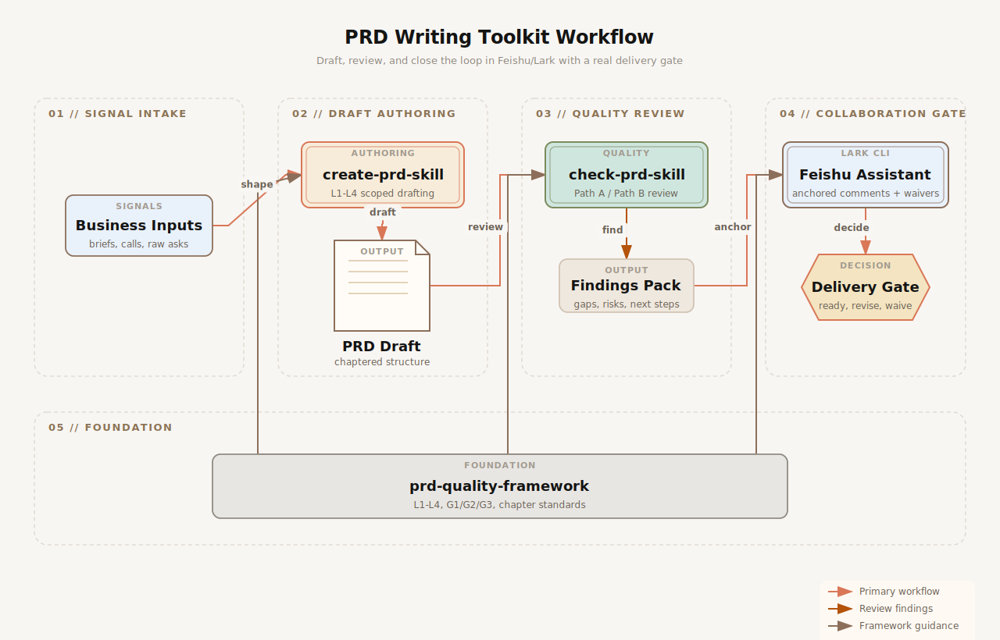

# PRD Writing Toolkit

AI PRD generation, PRD review, and Feishu/Lark collaboration workflows for B2B product management and system design.

> 中文简介：这是一套面向 B 端产品经理的 AI Native 工具链，把 **写 PRD、审 PRD、在飞书里协作收口** 串成一个真正可落地的闭环。

`PRD Writing Toolkit` is designed for teams that want more than a single prompt file. It turns product writing and review into a repeatable operating system:

- **AI PRD generation** for turning raw context into structured drafts
- **PRD review** for catching gaps, contradictions, and risk before handoff
- **Feishu/Lark collaboration** for writing comments back, collecting decisions, and controlling a real delivery gate
- **B2B product management** and **system design** workflows that respect complexity instead of forcing every requirement into the same template

## Origins & Credits

This toolkit is an integrated workflow product, but it does not erase where the core upstream skill work came from.

- `create-prd-skill` in this repository builds on the original [pmYangKun/create-prd-skill](https://github.com/pmYangKun/create-prd-skill)
- `check-prd-skill` in this repository builds on the original [pmYangKun/check-prd-skill](https://github.com/pmYangKun/check-prd-skill)

Huge thanks to [pmYangKun](https://github.com/pmYangKun) for creating and open-sourcing the original `create-prd` and `check-prd` skill repositories. `PRD Writing Toolkit` extends those foundations into a fuller end-to-end workflow with a vendored quality framework and a Feishu/Lark delivery gate.

## Who This Is For

- Product managers writing B2B PRDs, solution specs, and internal system proposals
- AI-native PM teams that want a reusable workflow, not just one-off prompting
- Product ops or design review teams that need a consistent delivery gate
- Teams using Feishu/Lark as the place where review feedback actually gets resolved

## Three Core Workflows

### 1. Generate a draft with `create-prd-skill`

Start from a business brief, workshop notes, or even a one-line idea. The generator classifies the request by complexity, chooses the right chapter depth, and produces a structured PRD scaffold instead of a generic wall of text.

Best for:

- New feature PRDs
- Internal system specs
- Module-level solution drafts
- Turning meetings into first-pass product docs

### 2. Review with `check-prd-skill`

Review a PRD using the right path for the document you actually have:

- **Path A** for standard, chapter-based PRDs
- **Path B** for messy, free-form docs that still need rigorous review

This keeps review quality high even when documentation quality is uneven.

Best for:

- Pre-dev readiness review
- Cross-functional PRD critique
- System design quality checks
- Catching missing flows, data, permissions, and exception handling

### 3. Close the loop in `feishu-prd-review-loop`

Push findings back into Feishu/Lark, collect `采纳 / 不采纳`, generate confirmation cards before any document edit, log waivers, and decide whether the PRD is truly ready for development.

Best for:

- PRD review in Feishu docs
- PM/design/dev alignment workflows
- Auditability for review decisions
- Teams that want a real **delivery gate**, not just comments scattered across threads

## Architecture



The production prompt, structured diagram data, and exported assets for this workflow live in [`assets/diagrams/`](assets/diagrams/).

## Why This Design Is Different

- **Complexity-aware by default**: L1-L4 classification prevents over-writing tiny changes and under-specifying large systems.
- **Chapter-first, not checklist-only**: when a PRD has structure, review follows that structure. When it does not, the fallback 14-dimension path keeps quality from collapsing.
- **Delivery-gate oriented**: the Feishu assistant does not stop at “leave comments”; it tracks replies, confirmations, waivers, and readiness.
- **Progressive loading**: skills load only the framework files needed for the current stage, which keeps large workflows more stable in practice.
- **Built for B2B product work**: this toolkit assumes business flows, permissions, exceptions, architecture, and rollout matter.

## Quick Start

### 1. Clone the repo

```bash
git clone https://github.com/Scofy0123/prd-writing-toolkit.git
cd prd-writing-toolkit
```

### 2. Optionally install the canonical shared framework

The bundled skills in this repo already include vendored framework snapshots for zero-dependency installation. If you also want the framework available as a standalone reference module in your local skill inventory, install the top-level `prd-quality-framework` too:

```bash
cp -R prd-quality-framework ~/.claude/skills/prd-quality-framework
```

### 3. Install draft generation and review

```bash
bash create-prd-skill/install.sh
bash check-prd-skill/install.sh
```

### 4. Optionally install the Feishu assistant

This workflow requires `lark-cli` plus user-authenticated access to the target Feishu/Lark documents.

```bash
cp -R feishu-prd-review-loop ~/.agents/skills/feishu-prd-review-loop
```

### 5. Start using the workflow

Examples:

- `/create-prd` with a business brief to generate the first draft
- `/check-prd` with a PRD to run a readiness review
- Share a `feishu.cn` doc link and ask for a review loop when you want anchored comments and a delivery decision

## Feishu / Lark Collaboration Loop

The Feishu assistant is intentionally more opinionated than a normal commenting bot:

1. It classifies the PRD scope with L1-L4 complexity
2. It chooses the actual review chapter set
3. It writes one issue per anchored comment
4. It reads reply threads and normalizes `采纳 / 不采纳`
5. It requires PM confirmation before editing the PRD
6. It logs replies, waivers, and final processing into a feedback base
7. It evaluates a delivery gate instead of assuming “comments resolved = ready”

That makes it useful for real team workflows where review history matters.

## Repository Layout

| Module | Purpose | Upstream Origin |
| --- | --- | --- |
| `create-prd-skill/` | Complexity-aware AI PRD generation | Based on [pmYangKun/create-prd-skill](https://github.com/pmYangKun/create-prd-skill) |
| `check-prd-skill/` | Chapter-based review with fallback dimensions | Based on [pmYangKun/check-prd-skill](https://github.com/pmYangKun/check-prd-skill) |
| `feishu-prd-review-loop/` | Feishu/Lark review-to-delivery workflow | Workflow variant aligned with the `check-prd-skill` Feishu collaboration branch |
| `prd-quality-framework/` | Shared L1-L4 framework, chapter standards, and global checks | Packaged here as the first-class foundation of the toolkit |

## Roadmap

- Improve standalone installers for one-command setup
- Add more eval cases for L1/L2 lightweight requirements
- Expand English-language examples for global discoverability
- Add more operational templates for review governance and handoff quality

## Contributing

- Improve chapter standards inside `prd-quality-framework/`
- Add richer example prompts and PRD samples
- Contribute Feishu/Lark workflow fixtures and safer integration tests
- Open issues for gaps in AI PRD generation, PRD review, or delivery gate behavior
